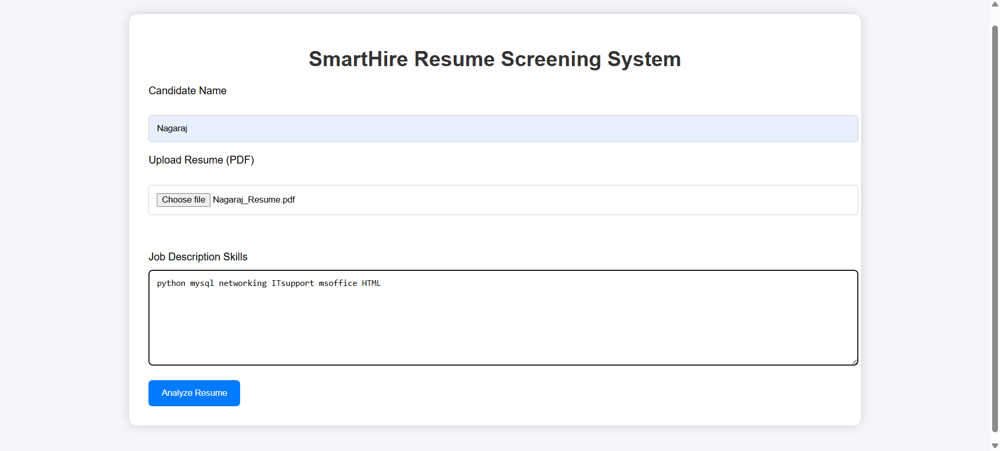
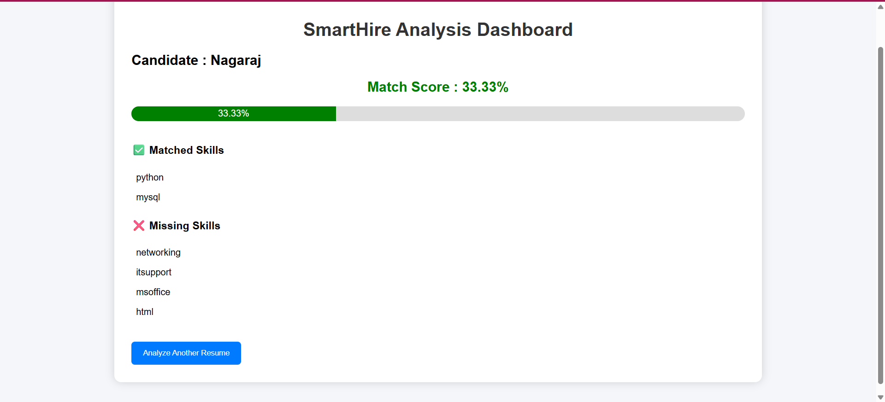
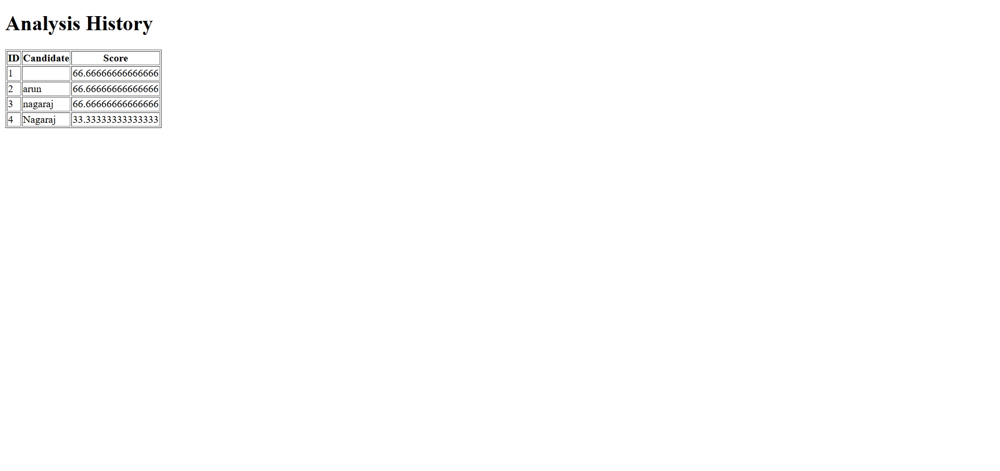

# SmartHire AI Resume Screening System

## Project Overview

SmartHire is a web-based resume screening application developed using Python and Flask. The system helps recruiters quickly evaluate candidate resumes by comparing uploaded resumes against job descriptions and generating a match score based on skill alignment.

The application automates the initial resume screening process, reducing manual effort and helping recruiters identify relevant candidates more efficiently.

---

## Key Features

- Upload resumes in PDF format
- Extract text from resumes automatically
- Compare resume skills with job requirements
- Generate candidate match scores
- Identify matched and missing skills
- Store candidate analysis results in SQLite database
- View historical candidate screening records
- Simple and user-friendly dashboard

---

## Technology Stack

### Backend
- Python
- Flask

### Frontend
- HTML5
- CSS3

### Database
- SQLite

### Libraries
- PyPDF2

---

## System Workflow

1. Candidate resume is uploaded in PDF format.
2. Resume text is extracted automatically.
3. Recruiter enters the job description.
4. The system compares resume skills with required skills.
5. A match score is calculated.
6. Matched and missing skills are displayed.
7. Analysis results are stored in the database.
8. Previous screening results can be viewed through the History page.

---

## Skills Demonstrated

Through this project, I gained hands-on experience in:

- Flask web application development
- Database integration using SQLite
- File upload handling
- PDF text extraction
- Backend logic implementation
- Frontend development with HTML and CSS
- CRUD operations
- Project structuring and GitHub version control

---

## Challenges Solved

- Implemented PDF resume parsing
- Built a skill matching algorithm
- Designed a database-backed screening workflow
- Managed candidate analysis history
- Integrated frontend and backend components

---

## Project Screenshots

### Home Page



### Result Dashboard



### Analysis History



## Run Locally

```bash
pip install -r requirements.txt
python app.py
```

Open:

http://127.0.0.1:5000


## Future Enhancements

### AI-Based Skill Extraction
Use Natural Language Processing (NLP) to automatically identify technical skills from resumes.

### Resume Ranking System
Rank multiple candidates based on job relevance and score.

### Recruiter Dashboard
Provide a centralized dashboard to manage candidates and screening results.

### Job Recommendation Engine
Suggest suitable job roles based on candidate skills.

### Cloud Deployment
Deploy the application on cloud platforms for public access and scalability.

### Advanced Analytics
Generate reports and visual insights for recruitment teams.

---

## Learning Outcomes

This project helped me understand how real-world recruitment systems work and improved my skills in:

- Python programming
- Web development
- Database management
- Software design
- Problem solving
- Full-stack application development

---

## Project Status

Completed Version 1.0

Current Features:
- Resume Upload
- Skill Matching
- Match Score Calculation
- Database Storage
- Analysis History

Future Versions will focus on AI-powered recruitment features and cloud deployment.

---

## Author

Nithiya Bharathi

MCA Graduate | Aspiring Software Engineer | Python & Cloud Enthusiast
